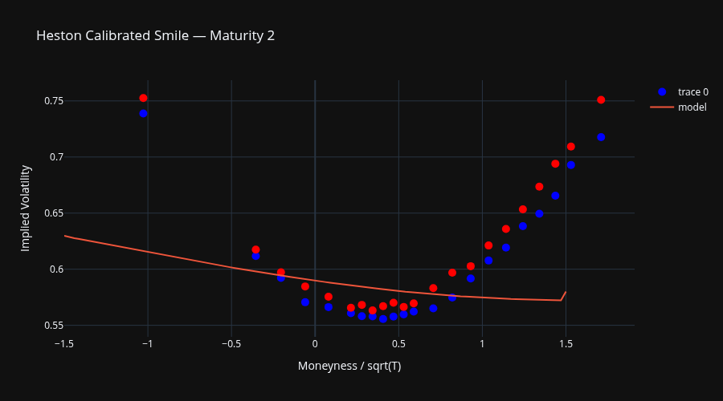
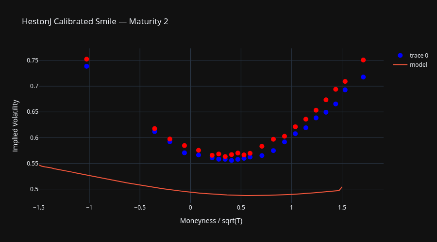

# Volatility Surface

This tutorial covers the full workflow for building and calibrating an implied volatility
surface: fetching option quotes from Deribit, inspecting the surface inputs, and
calibrating the Heston and Heston-jump-diffusion models.

## Fetching Data from Deribit

The [Deribit][quantflow.data.deribit.Deribit] client exposes a high-level
[volatility_surface_loader][quantflow.data.deribit.Deribit.volatility_surface_loader]
method that fetches all option quotes for a given asset and assembles them into a
[VolSurfaceLoader][quantflow.options.surface.VolSurfaceLoader]:

```python
import asyncio
from quantflow.data.deribit import Deribit

async def load():
    async with Deribit() as cli:
        loader = await cli.volatility_surface_loader("btc")
    return loader

loader = asyncio.run(load())
```

Key parameters of `volatility_surface_loader`:

| Parameter | Default | Description |
|---|---|---|
| `asset` | required | Underlying asset, e.g. `"btc"`, `"eth"`, `"sol"` |
| `inverse` | `True` | Inverse options (settled in the underlying) |
| `use_perp` | `False` | Derive spot from the perpetual contract |
| `exclude_open_interest` | `0` | Drop strikes with open interest below this threshold |

## Building the Surface

The loader holds the raw market data. Call
[surface()][quantflow.options.surface.GenericVolSurfaceLoader.surface] to construct a
[VolSurface][quantflow.options.surface.VolSurface]:

```python
surface = loader.surface()
```

Then run [bs()][quantflow.options.surface.VolSurface.bs] to populate implied
volatilities via Black-Scholes inversion:

```python
surface.bs()
```

[bs()][quantflow.options.surface.VolSurface.bs] solves for the implied volatility that
matches each bid and ask price and marks each option as `converged` or not.

### Removing Outliers

Raw option quotes often contain illiquid or stale prices that produce unrealistic
implied volatilities.
[disable_outliers()][quantflow.options.surface.VolSurface.disable_outliers] removes
them in two passes per maturity:

1. **Wide spread filter** — options whose implied-vol bid/ask spread exceeds 30% of the
   mid vol are marked as not converged.
2. **Polynomial smile fit** — a quadratic is fitted to the remaining smile; options
   whose residual exceeds the 99th-percentile threshold are disabled. This is repeated
   twice.

```python
surface.disable_outliers()
```

## Inspecting Surface Inputs

The examples below use a saved snapshot of a real ETH surface. The workflow is identical
for a live surface fetched from Deribit.

```python
--8<-- "docs/examples/vol_surface_inputs.py"
```

[term_structure()][quantflow.options.surface.VolSurface.term_structure] shows forward
prices and the interest rate implied by the forward-spot basis for each maturity. The
option inputs table lists the bid/ask prices together with the corresponding implied
volatilities for each strike:

```
--8<-- "docs/examples_output/vol_surface_inputs.out"
```

## Serialising and Restoring

[inputs()][quantflow.options.surface.VolSurface.inputs] serialises the surface to a
[VolSurfaceInputs][quantflow.options.inputs.VolSurfaceInputs] object — a list of
[SpotInput][quantflow.options.inputs.SpotInput],
[ForwardInput][quantflow.options.inputs.ForwardInput], and
[OptionInput][quantflow.options.inputs.OptionInput] records — that can be stored or
transmitted as JSON and later reconstructed via
[surface_from_inputs][quantflow.options.surface.surface_from_inputs]:

```python
from quantflow.options.surface import surface_from_inputs

inputs = surface.inputs(converged=True)   # VolSurface -> VolSurfaceInputs
surface2 = surface_from_inputs(inputs)    # VolSurfaceInputs -> VolSurface
```

## Calibrating the Heston Model

[HestonCalibration][quantflow.options.calibration.HestonCalibration] wraps an
[OptionPricer][quantflow.options.pricer.OptionPricer] and the surface, then minimises
the squared residuals between market bid/ask call prices and model prices across all
strikes and maturities.

```python
--8<-- "docs/examples/vol_surface_heston_calibration.py"
```

```
--8<-- "docs/examples_output/vol_surface_heston_calibration.out"
```

### Calibration Options

[remove_implied_above()][quantflow.options.calibration.VolModelCalibration.remove_implied_above]
drops options with implied vols above the given quantile before fitting — useful for
excluding illiquid deep wings.

The `moneyness_weight` parameter down-weights far-from-the-money options via
$e^{-w \cdot |k|}$ where $k = \log(K/F)$. Setting `ttm_weight > 0` similarly
down-weights near-expiry options.

### Plotting the Calibrated Smile

Use [plot()][quantflow.options.calibration.VolModelCalibration.plot] to produce a
Plotly figure overlaying market bid/ask implied vols against the model smile:

```python
fig = calibration.plot(index=1, max_moneyness_ttm=1.5, support=101)
fig.write_image("heston_calibrated_smile.png", width=900, height=500)
```



## Calibrating the Heston Jump-Diffusion Model

[HestonJCalibration][quantflow.options.calibration.HestonJCalibration] extends the
Heston calibration with a compound Poisson jump component via the
[HestonJ][quantflow.sp.heston.HestonJ] model. Jumps are drawn from a
[DoubleExponential][quantflow.utils.distributions.DoubleExponential] distribution,
which captures asymmetric jump behaviour common in equity and crypto markets.

```python
--8<-- "docs/examples/vol_surface_hestonj_calibration.py"
```

```
--8<-- "docs/examples_output/vol_surface_hestonj_calibration.out"
```

### Plotting the Calibrated Smile

Use [plot()][quantflow.options.calibration.VolModelCalibration.plot] to produce a
Plotly figure overlaying market bid/ask implied vols against the model smile:

```python
fig = calibration.plot(index=1, max_moneyness_ttm=1.5, support=101)
fig.write_image("hestonj_calibrated_smile.png", width=900, height=500)
```



### Parameter Reference

The calibrated parameter vector for the jump-diffusion model is:

| Parameter | Description |
|---|---|
| `vol` | Initial volatility ($\sqrt{v_0}$) |
| `theta` | Long-run volatility ($\sqrt{\theta}$) |
| `kappa` | Mean reversion speed |
| `sigma` | Volatility of variance |
| `rho` | Spot-variance correlation |
| `jump intensity` | Jump arrival rate (jumps per year) |
| `jump variance` | Variance of a single jump |
| `jump asymmetry` | Asymmetry of the jump distribution ([DoubleExponential][quantflow.utils.distributions.DoubleExponential]) |
