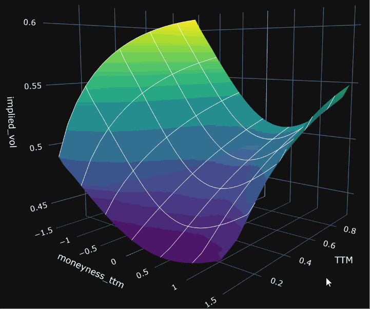

---
jupytext:
  formats: ipynb,md:myst
  text_representation:
    extension: .md
    format_name: myst
    format_version: 0.13
    jupytext_version: 1.14.7
kernelspec:
  display_name: Python 3 (ipykernel)
  language: python
  name: python3
---

# Quantflow

A library for quantitative analysis and pricing.




This documentation is organized into a few major sections.
* **Theory** cover some important concept used throughout the library, for the curious reader
* **Stochastic Processes** cover all the stochastic models supported and their use
* **Applications** show case the real-world use cases
* **Examples** random examples
* **API Reference** python API reference``

```{code-cell} ipython3

```
